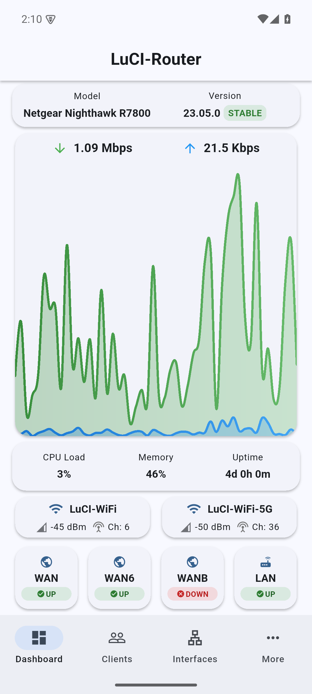
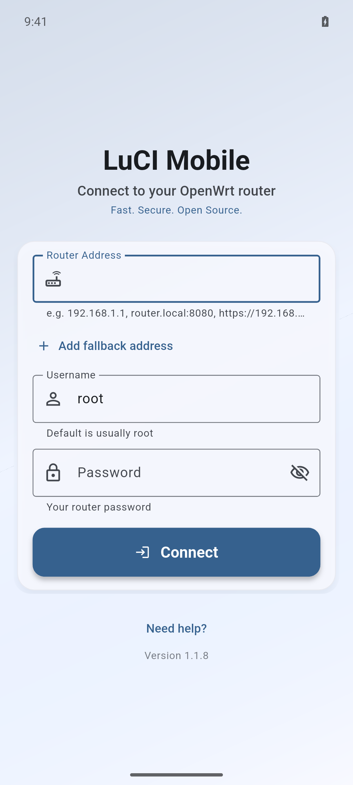
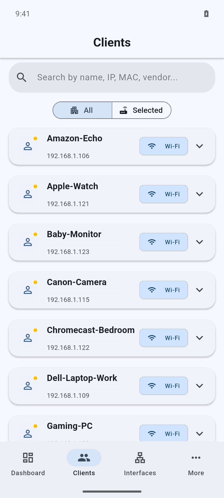
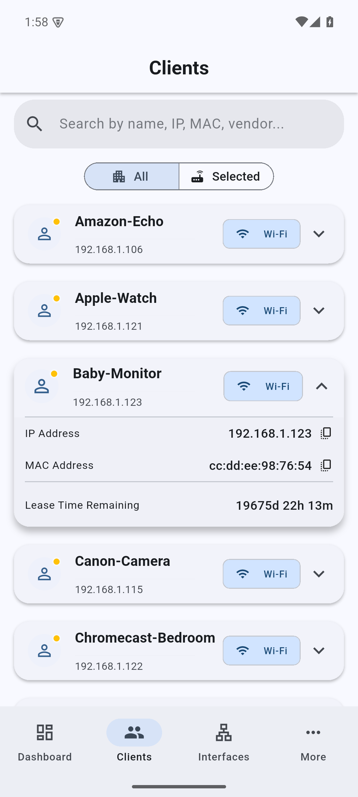
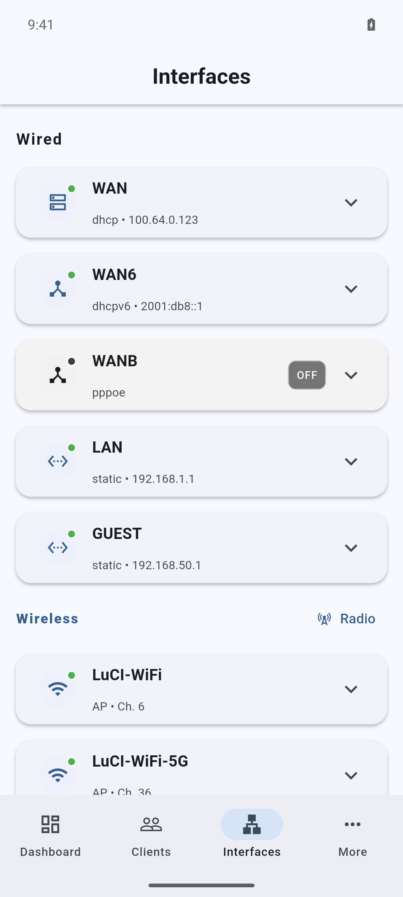
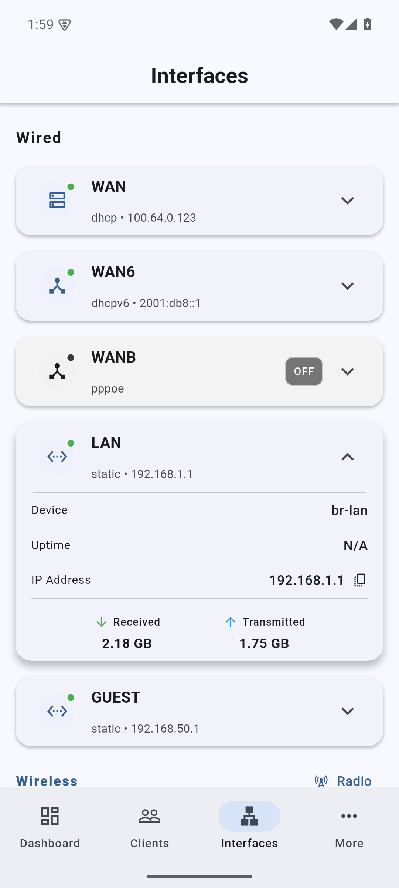
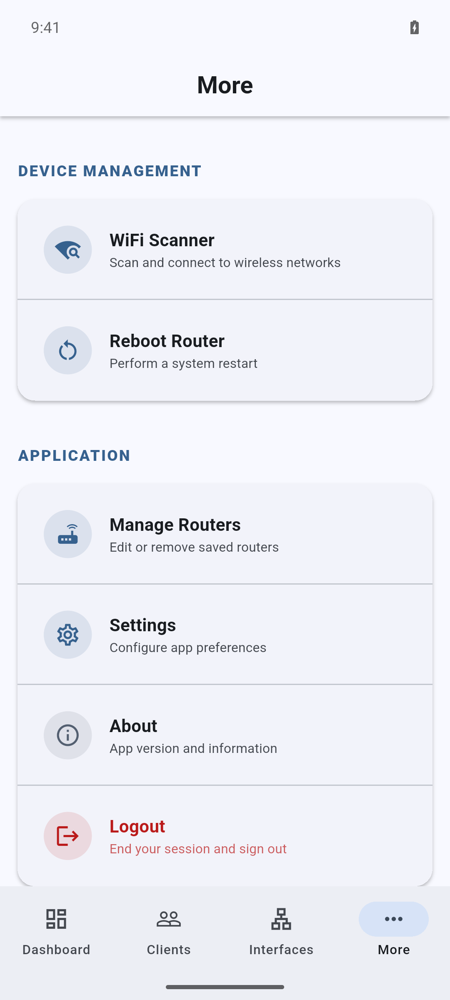

# LuCI Mobile

<div align="center">
  <a href="https://play.google.com/store/apps/details?id=com.cogwheel.LuCIMobile">
    
  </a>
  <a href="https://apps.apple.com/app/luci-mobile/id6749455847">
    
  </a>
  <a href="https://apt.izzysoft.de/fdroid/index/apk/com.cogwheel.LuCIMobile">
    
  </a>
  <br><br>

  
  
  <br><br>

  
</div>

LuCI Mobile is an open-source Flutter client for OpenWrt routers. It talks to LuCI RPC so you can check router health, inspect clients and interfaces, scan Wi-Fi networks, and handle common admin tasks from a phone.

## What it does

- Saves multiple router profiles and switches between them. A profile can include a fallback address for access from another network.
- Shows throughput, CPU load, memory use, uptime, wireless signal, and interface status on one dashboard.
- Lists clients for every saved router or only the selected router. Search by hostname, IP address, MAC address, or vendor.
- Shows wired and wireless interface details, traffic totals, addresses, radio state, and channel information.
- Scans nearby Wi-Fi networks and can connect a router radio as a station.
- Reboots a router after confirmation.
- Follows the system theme or uses a selected light or dark theme.

Credentials and router profiles are stored through `flutter_secure_storage`. The app asks before trusting a self-signed HTTPS certificate. It does not include analytics, tracking, or advertising SDKs.

## Screenshots

| Dashboard | Login | Clients | Client details |
| --- | --- | --- | --- |
|  |  |  |  |

| Interfaces | Interface details | More |
| --- | --- | --- |
|  |  |  |

## Install

Use [Google Play](https://play.google.com/store/apps/details?id=com.cogwheel.LuCIMobile), the [Apple App Store](https://apps.apple.com/app/luci-mobile/id6749455847), or [IzzyOnDroid](https://apt.izzysoft.de/fdroid/index/apk/com.cogwheel.LuCIMobile).

To run the source, install Flutter with Dart 3.8.1 or newer, then run:

```bash
git clone https://github.com/cogwheel0/luci-mobile.git
cd luci-mobile
flutter pub get
flutter run
```

Useful checks:

```bash
flutter analyze
flutter test
```

## Router setup

The router must run OpenWrt with LuCI enabled. LuCI Mobile also needs the LuCI RPC and wireless information modules:

```sh
# OpenWrt using opkg
opkg update
opkg install rpcd-mod-luci rpcd-mod-iwinfo

# OpenWrt using apk
apk update
apk add rpcd-mod-luci rpcd-mod-iwinfo

/etc/init.d/rpcd restart
```

Check that the RPC object is available:

```sh
ubus list luci-rpc
ubus call luci-rpc getNetworkDevices '{}'
```

## Troubleshooting

- If the app cannot connect, open the same router address in a browser and check the scheme, port, firewall, and VPN route.
- If login fails, verify the username, password, and administrator permissions in LuCI.
- If the dashboard is empty, install the RPC modules above, restart `rpcd`, and run the two `ubus` checks.
- Accept a self-signed certificate only after checking that its fingerprint belongs to your router.

## Contributing

See [CONTRIBUTING.md](CONTRIBUTING.md) for the development workflow. Bug reports and focused pull requests are welcome.

## License

LuCI Mobile is licensed under [GPL-3.0](LICENSE). It is an independent project and is not affiliated with OpenWrt.

Thanks to the OpenWrt and Flutter communities, the project contributors and testers, and [OpenWrtManager](https://github.com/hagaygo/OpenWrtManager) for early inspiration.
